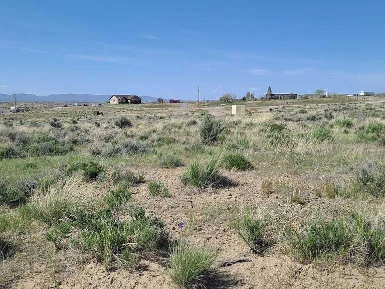

<!DOCTYPE html>
<html lang="en">
<head>
  <meta charset="UTF-8">
  <meta name="viewport" content="width=device-width, initial-scale=1.0">
  <title>Bellino Properties LLC - Land Sales</title>
  <link href="https://fonts.googleapis.com/css2?family=Montserrat:wght@400;600&display=swap" rel="stylesheet">
  
</head>
<body>
  <header>
    
    <nav>
      <ul>
        <li><a href="#accept-offers">Accept Offers</a></li>
        <li><a href="#properties-for-sale">Properties for Sale</a></li>
        <li><a href="#past-sales">Past Sales</a></li>
      </ul>
    </nav>
  </header>

  

    <h1>Bellino Properties LLC</h1>
    
Your Trusted Partner in Land Sales

    
Cash Offers | No Fees | Quick Closes

    <a href="#properties-for-sale"><button>Explore Properties</button></a>
  

  <!-- Accept Offers Section -->
  <section id="accept-offers" style="text-align: center;">
    <h2>Accept an Offer</h2>
    <iframe
      src="https://docs.google.com/forms/d/e/1FAIpQLSeX19pIzaSywGQVpxsiM8POFiXGFcP88HvQSOlyQZ9klxZZLw/viewform?embedded=true"
      width="500"
      height="400"
      frameborder="0"
      marginheight="0"
      marginwidth="0"
      style="border: 1px solid #ccc; border-radius: 8px;">
    Loading…
    </iframe>
  </section>

  <!-- Properties for Sale Section -->
  <section id="properties-for-sale">
    <h2>Properties for Sale</h2>
    <ul>
      <li>
        <h3>2.7 Acres</h3>
        
$18,500

        
Elko, NV

        
      </li>
      <li style="position: relative;">
        <h3>0.5 Acres</h3>
        
$80,000

        
Jupiter, FL

        <a href="#" target="_blank" style="position: relative; display: inline-block;">
          
          Under Contract!
        </a>
      </li>
      <li style="position: relative;">
        <h3>25 Acres</h3>
        
$73,250

        
Hartsell, CO

        <a href="#" target="_blank" style="position: relative; display: inline-block;">
          
          Under Contract!
        </a>
      </li>
    </ul>
  </section>

  <!-- Past Sales Section -->
  <section id="past-sales">
    <h2>Past Sales</h2>
    <ul>
      <li style="position: relative;">
        <h3>1.13 Acres</h3>
        
Sold for $7,995

        
Yucca, AZ

        

          
          SOLD!
        

      </li>
      <li>
         <h3>1.13 Acres</h3>
        
Sold for $30,000

        
Golden Valley, AZ

        

          
          SOLD!
        

      </li>
      <li>
        <h3>0.25 Acres</h3>
        
Sold for $9,900

        
Pahrump, NV

        

          
          SOLD!
        

      </li>
    </ul>
  </section>
</body>
</html>
